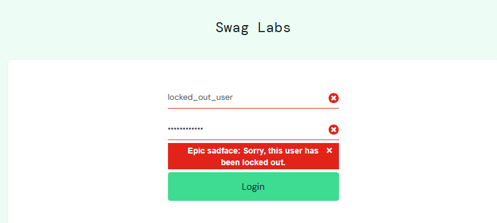
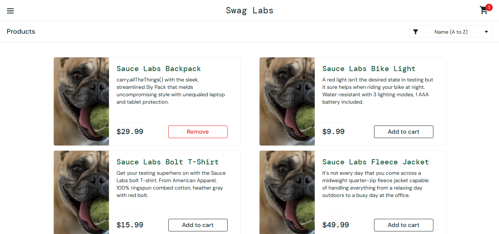
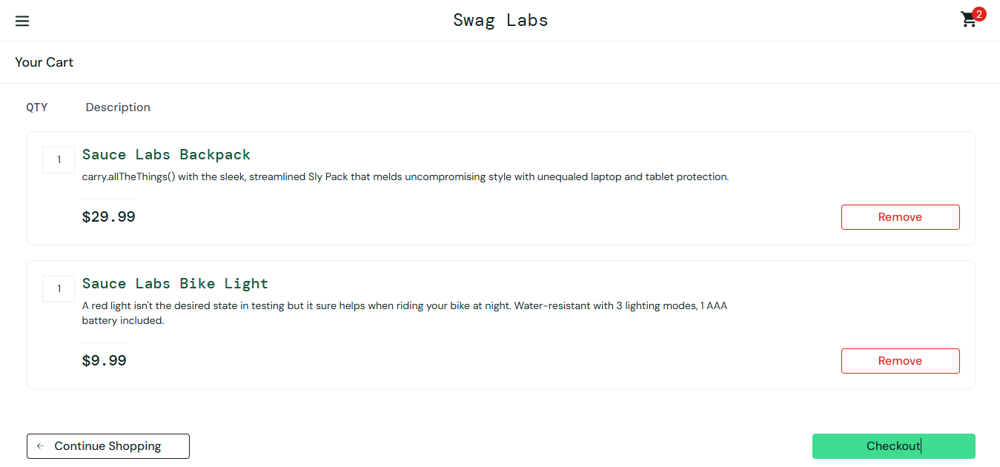
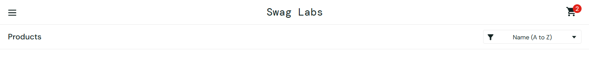

# Bug Report

## BUG-001 - Locked user error message unclear

### Description
When attempting to log in with a locked user account, the system displays a generic error message that does not clearly indicate the reason for the failure.  
The lack of clarity may confuse users and does not provide guidance on how to proceed.

### Steps to Reproduce
1. Open https://www.saucedemo.com/
2. Enter username: locked_out_user
3. Enter password: secret_sauce
4. Click Login

### Expected Result
A clear message indicating that the user account is locked and suggesting contacting support.

### Actual Result
A generic error message is displayed without clear explanation.

### Severity
High

### Priority
High

### Environment
Chrome 123 | Windows 11 | locked_out_user

### Impact
Users may not understand why login failed, increasing confusion and potential support requests.

### Evidence

## BUG-002 - Incorrect product images for problem_user

### Description
After logging in with the problem_user account, product images displayed on the inventory page are incorrect.  
All products show the same image, which does not correspond to the actual product, affecting usability and visual validation.

### Steps to Reproduce
1. Login with username: problem_user
2. Enter password: secret_sauce
3. Navigate to inventory page
4. Observe product images

### Expected Result
Each product should display its corresponding image.

### Actual Result
All products display the same incorrect image.

### Severity
Medium

### Priority
Medium

### Environment
Chrome 123 | Windows 11 | problem_user

### Impact
Compromises user experience and makes it difficult to identify products visually.

### Evidence

## BUG-003 - Cart is not cleared after logout and new login

### Description
After adding items to the cart and performing a logout, the cart retains previously added items when the user logs in again.  
This behavior indicates that the session is not properly reset, causing data persistence across sessions.

### Steps to Reproduce
1. Login with user: standard_user
2. Add two products to the cart
3. Logout from the application
4. Login again with the same user
5. Check the cart icon

### Expected Result
The cart should be empty when starting a new session.

### Actual Result
The cart still contains items from the previous session.

### Severity
Medium

### Priority
High

### Environment
Chrome 123 | Windows 11 | standard_user

### Impact
May lead to unintended purchases and compromises session integrity.

### Evidence
Before logout:

After new login:

## BUG-004 - First name field accepts blank spaces

### Description

The first name field accepts blank spaces as valid input.

### Steps to Reproduce

1. Login with standard_user
2. Add item to cart
3. Go to checkout
4. Enter " " (space) in First Name
5. Fill other fields
6. Click Continue

### Expected Result

Field should require valid characters.

### Actual Result

Form proceeds with blank value.

### Severity

Low

### Priority

Low

### Environment

Chrome | Windows 11 | standard_user

### Impact

Incomplete customer data may be submitted.

## BUG-005 - Checkout accepts invalid ZIP code

### Description

The ZIP code field accepts non-numeric values without validation.

### Steps to Reproduce

1. Login with standard_user
2. Add item to cart
3. Go to checkout
4. Enter "abc" in ZIP code
5. Click Continue

### Expected Result

ZIP code should validate numeric input.

### Actual Result

Form proceeds without validation.

### Severity

Low

### Priority

Low

### Environment

Chrome | Windows 11 | standard_user

### Impact

Invalid shipping data may be accepted.

### Evidence

Before submit:

After submit:

